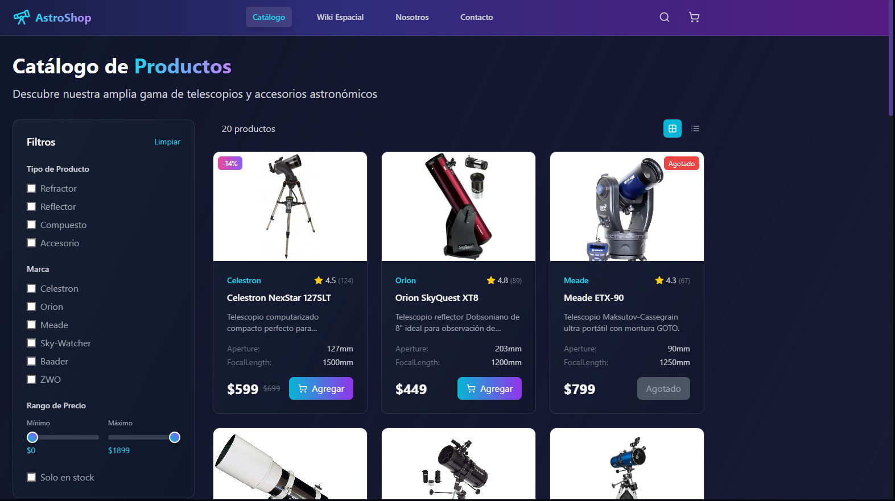
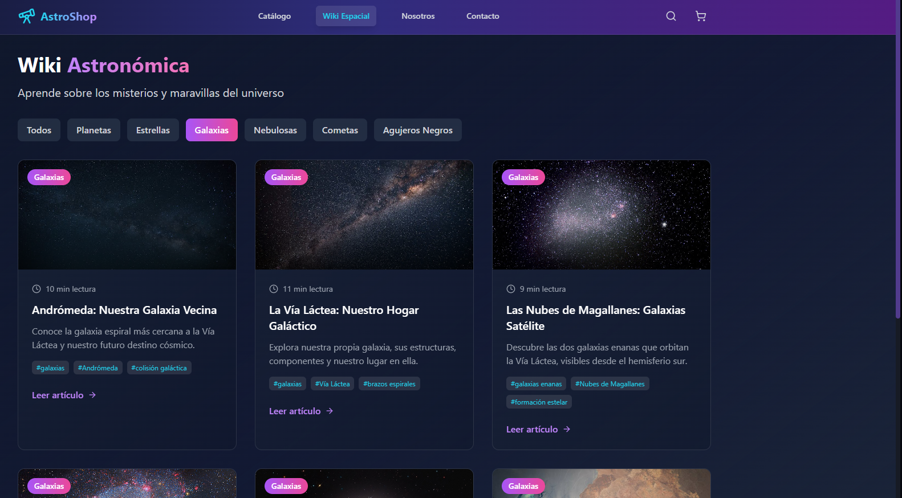

# 🔭 EclipsE-Commerce

Una tienda online moderna y profesional, especializada en telescopios y productos relacionados con la astronomía, desarrollada con React.

Este proyecto es una remasterización de una versión anterior con el mismo nombre, mejorando el diseño, la experiencia de usuario y la funcionalidad para ofrecer una plataforma más completa y atractiva para los amantes del cosmos.

  <h3>🚀 AstroShop</h3>
  
E-Commerce moderno y completo desarrollado con mucho amor y dedicacion.

  

## ✨ Características

### 🛍️ E-Commerce Completo
- **Catálogo de productos** con filtros avanzados por tipo, marca, precio y disponibilidad
- **Carrito de compras** interactivo con gestión de cantidades
- **Sistema de checkout** simulado con cálculo de impuestos y envío
- **Búsqueda inteligente** de productos y artículos
- **Vistas de producto** detalladas con especificaciones técnicas

### 📚 Wiki Astronómica
- **Enciclopedia interactiva** con artículos sobre planetas, estrellas, galaxias y más
- **Categorización inteligente** de contenido astronómico
- **Artículos detallados** con imágenes de alta calidad
- **Sistema de etiquetas** para navegación fácil

### 🎨 Diseño Moderno
- **Interfaz espacial** con animaciones de estrellas y efectos visuales
- **Diseño responsivo** optimizado para todos los dispositivos
- **Gradientes dinámicos** y efectos de hover sofisticados
- **Tema oscuro** inspirado en el cosmos

## 🎯 Funcionalidades Principales

### Catálogo de Productos
- **20+ productos** de telescopios y accesorios
- **Filtros avanzados** por tipo, marca, precio
- **Vistas de grid y lista**
- **Detalles completos** con especificaciones

### Carrito de Compras
- **Gestión de cantidades** en tiempo real
- **Cálculo automático** de subtotal, impuestos y envío
- **Envío gratis** en compras superiores a $500
- **Proceso de checkout** 

### Wiki Astronómica
- **50+ artículos** sobre objetos celestes
- **6 categorías**: Planetas, Estrellas, Galaxias, Nebulosas, Cometas, Agujeros Negros
- **Contenido educativo** con imágenes reales del espacio
- **Tiempo de lectura** estimado para cada artículo

### Formulario de Contacto
- **Validación completa** de campos
- **Envío de emails** via Resend API
- **Respuestas automáticas** con confirmación
- **Diseño responsive** y accesible

## 📱 Responsive Design

- **Mobile First** approach
- **Breakpoints**: sm (640px), md (768px), lg (1024px), xl (1280px)
- **Navegación móvil** con menú hamburguesa
- **Imágenes optimizadas** para diferentes densidades

## 🌟 Características Técnicas

### Performance
- **Lazy loading** de imágenes
- **Code splitting** automático con Vite
- **Optimización de bundle** size
- **Caching** inteligente de recursos

### Accesibilidad
- **Navegación por teclado** completa
- **ARIA labels** apropiados
- **Contraste de colores** WCAG compliant
- **Screen reader** friendly

## 📄 Licencia

Este proyecto está bajo la Licencia MIT. Ver el archivo `LICENSE` para más detalles.

## 👨‍💻 Autor

**Facundo Carrizo**
- Email: Facu14carrizo@gmail.com
- GitHub: [@tu-usuario](https://github.com/facu14carrizo)

## 🙏 Agradecimientos

- **NASA** por las imágenes astronómicas
- **Unsplash** por las fotografías de telescopios
- **Lucide** por los iconos
- **Tailwind CSS** por el sistema de diseño
- **React Team** por la increíble librería

## 📊 Estadísticas del Proyecto

- **Componentes**: 15+
- **Páginas**: 5
- **Productos**: 20+
- **Artículos Wiki**: 50+
- **Líneas de código**: 3000+
- **Tiempo de desarrollo**: 3 semanas

---

**🌟 ¡Dale una estrella si te gusta el proyecto! 🌟**

